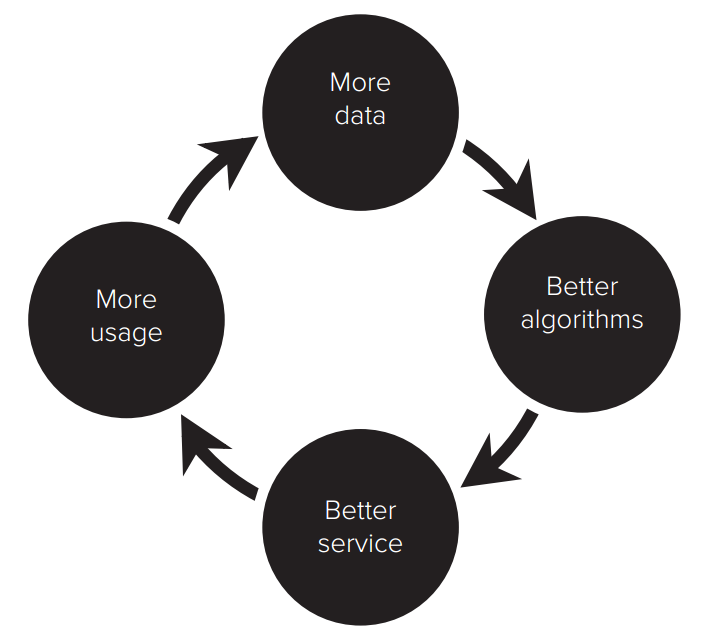
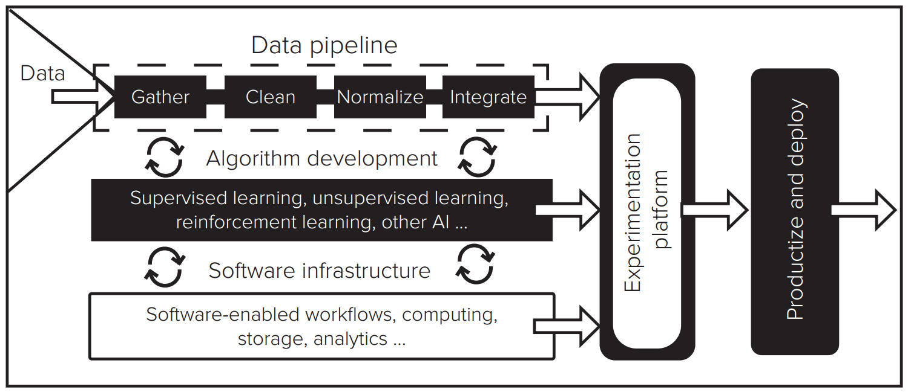
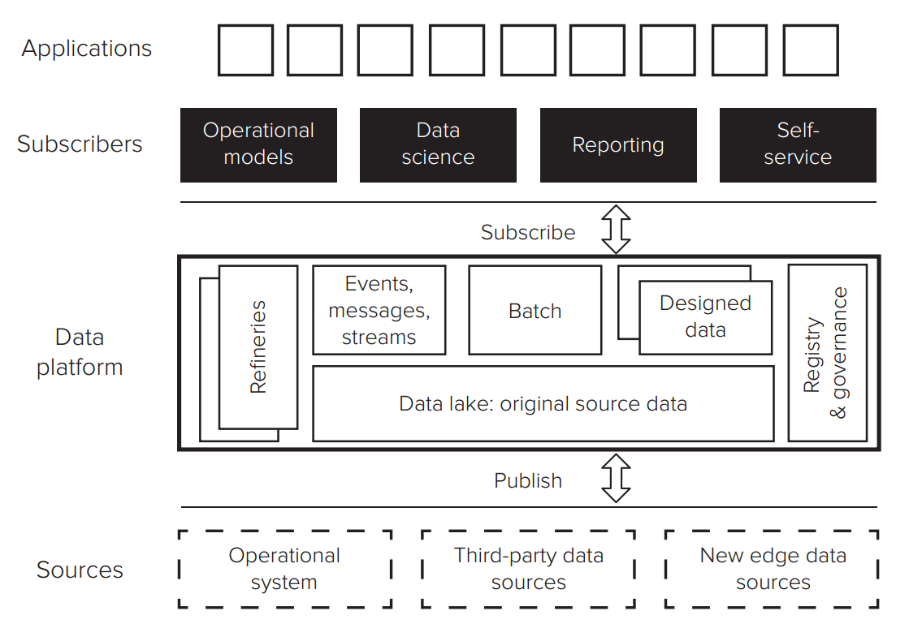

# 1: Introduction to AI

- Introduction to AI and related technologies
- Recent advances in AI
- Group Presentation Lottery

# Content
- General overview & trends of AI

# Presentation
**Big Ideas List**

1. Huge increases in computing power and big data have catapulted AI forward in the past 5 years
2. Deep Learning, a form of AI, is now able to complete many complex tasks
3. The expansion of deep learning tools to nearly all industries contribuets to an exponential increase in data flows across borders
4. AI, a general purpose technology, is disrupting business processes, labor markets, and global economic relations

**Data -> AI -> Business value**

- AI informs Decision making (using data analysis)
- New business models (new forms of value creation)
- Personalized products and individualized predictions

**Milestones**

- Games: DeepBlue (Chess) -> DeepMind (Go)
	- Go thought to be impossible for AI to outcompete humans (amount of possibilities)
- Information: IBM Watson (Jeopardy)
- Intelligence: Passing Turing test
- Future: Moments where we realize computers are better at the task than I am

**Moore's Law**

- Reason for surprising innovation of digital technology
- Machine Learning: Simple tasks but a lot of computations
- Moore's law: Computational power doubling every 18 months
- Amara's Law: Humans difficult to grasp exponential growth

**How does it work?**

- Definition: AI is prediction and optimization technology using data-fueled statistical estimation
- Computer ability to learn without being explicitly progammed (too many set of rules)
- e.g. Image Recognition too difficult with rules based programming
- Evolution: AI -> ML -> Deep Learning (DL)

**Deep Learning**

- Deep Learning: Recognition not through rules, but by practice and feedback
- Common: Learning algorithm is trained using labeled examples by adjusting weights to reduce prediction error
- Image Recognition Layers: 1 (Recognise pixels and shapes), 2 (Complex shapes and features), 3 (Which shapes used for identifiation)

**Context**

- AI Complex tasks: Reasoning, Knowledge, Planning, Communication, Perception
- Ant Financial: Giving out loans predicting credibility based on data from alibaba (lowest error rate)

# Required Readings
## The Business of Artificial Intelligence
### Introduction
- **General Purpose Technologies:** Economic Growth through invention of general purpose technologies. Companies leveraging these innovations achieved high profits (Examples: Steam Engine, Internet). Will be used in every industry, doing various tasks different in their nature.
- **Disruption Potential:** AI as the most important general purpose technology with the potential to have a transformational impact on a similar scale to prior revolutions (e.g. combustion engine).
- **Current Issues:** Unrealistic expectations and bottleneck in management and implementation

### What can AI do today?
- **Two Broad Areas:** Perception (Voice Recognition, Computer Vision) & Cognition (Games, Fraud and Malware Detection, Stock Trading)
- **State:** ML systems are replacing older processes and are superior at many tasks that were once done best by humans
- **Characteristics**: Specific Tasks (Lack Context and Understanding), Learning by examples (not explicitly programmed)

### Categories
- **Supervised learning**: Give many examples (ref. Training Set) of correct answers to a particular problem (Mapping X -> Y)
- **Unsupervised learning**: Solve given objective (e.g. pattern recognition) 
- **Reinforcement learning:** Specify goal (objective function), describe environment and list allowable actions

### Opportunities
- **Three Levels:** Occupations (Radiology), Business Processes (Amazon Fulfillment Center), Business Models (Recommender Systems)

### Risks and Limits
- **Low interprepability:** Difficulties understanding decision-processes. MAchines know more than theyc an tell us
	- Hidden biases (dataset)
	- Statistical Truths Based (Lack Verifiability)
	- Error Correction (Difficult due to complex structure)
- **Limit:** Computers are good for answering questions not for asking them.
- **Disruption:** Companies too slow to adapt will be outcompeted

## The AI Factory

### Introduction
- **Definition:** Decision engine that treats decision making as an industrial process. Converting data into predictions and choices to guide (or automate) a variety of operational actions.

<figure markdown>
  { width="300" }
  <figcaption>Virtous Cycle</figcaption>
</figure>

- **Search Engines**: The more searches, the better the predictions, and the better the predictions, the more the search engine is used.
- **Experimentation**: Hypotheses can be tested on a statistically relevant sample of users to derive conclusions

<figure markdown>
  { width="500" }
  <figcaption>AI Factory Components</figcaption>
</figure>

If the data is the fuel that powers the AI factory, then infrastructure makes up the pipes that deliver the fuel, and the algorithms are the machines that do the work. The experimentation platform, in turn, controls the valves that connect new fuel, pipes, and machines to existing operational systems.

### Machine Learning Algorithms
**Supervised learning**

- **Objective:** Rely on expert-labeled dataset, mapping input (X) to outcome (Y)
- Training dataset (determines parameters of model) and Validation dataset (test accuracy of model)
- Examples: Spam Detection, Image Recognition, Recommendations by Clustering

**Unsupervised Learning**

- **Objective:** Discover insights in data with assumptions
- **Three Types**
	- Clustering: Data into groups 
	- Association rule mining: creating associations to e.g. recommend similar products
	- Anomaly detection: Whether or not new item fits prior patterns
- Find "natural" grouping in data (No labeling)
- Examples: Anomaly detection

**Reinforcement Learing**

- Requires only starting point and objective function
- Dynamic tradeoff between exploration & exploitation
- Examples: Recommender Systems, Games

### Experimentation Platform
- **A/B Testing** Expose set of users to change (known as treatment) and compare to users with usual experience (known as control). Then compare the differences.
- **Continuity** Continuous feedback between new insights and validation or explanation

### Software Infrastructure
<figure markdown>
  { width="500" }
  <figcaption>Virtous Cycle</figcaption>
</figure>

- **Data platform:** Provides structure for developers to build deploy and execute AI applications
- **Publish-subscribe:** Make clean and consistent data available to applications through consistent interfaces (APIs)
- **Importance** Develop a secure and centralized data platform to focus on data governance

## Huge ‘Foundation Models’ are Turbocharging AI Progress.

- Previously assumed that increasing data will lead to diminishing return. However, with models like BERT the reverse was observed (increasing returns)
- ML models based on neural networks (connections)
- Weights of connections between viirtual neurons are developed through trial and error, as model is trained with input - output mapping

