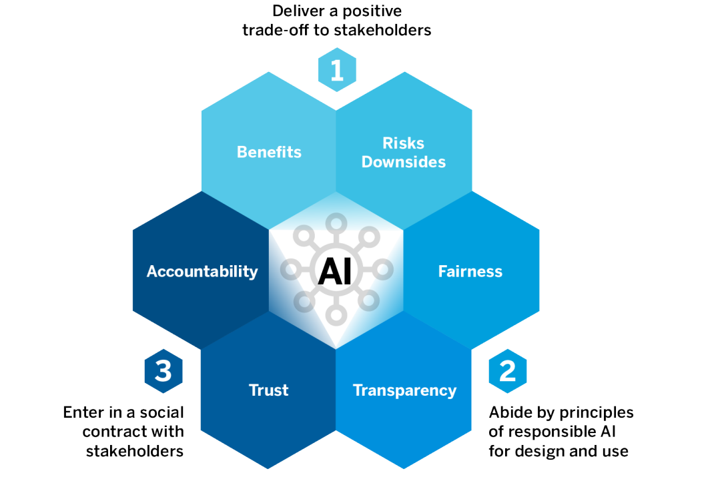

# 5: Implications of The AI Economy

## Surveillance Capitalism Discussion
1. What role do you play in surveillance capitalism markets?
	- Our Data is an Input

2. What has been the role of government in the surveillance capitalism?
	- Missing property rights of data
	- Haven't established extensive rules and regulation
	- Not many punishments

3. What should be the role of government in the future of surveillance capitalism?
	- Filling in the missing institutions

## Social Contract Discussion
1. Do you agree that AI requires a ‘social license’? Why or why not?
2. How can society build trust around AI?
3. What aspects of AI most concern you? How can your concerns be addressed by. . . business? by. . . government?
	- Uprising due to increasing inequality
	- Influence of Public Opinion (Monetary or politically incentivized)

## AI-at-Scale on Gaining a Social License

<figure markdown>
  { width="500" }
  <figcaption>Three Pillars of the Social License</figcaption>
</figure>

### Concerns
- Algorithmic institutionalization of income, gender, racial, and geographic prejudices
- privacy concerns and political issues
- Georgetown launched "AI Incident Database" recording cases in which intelligent system have caused safety or fairness issues (1'200 publicily recorded cases)

### Responsible AI
- Responsible AI has proved to be insufficient for two Reasons
	1. Technology-based approach (impossible to eliminate bias introduced by humans)
	2. Data scientists and Software developers having to be responsible
- Two propositions (before approving AI applications)
	1. Public institutions must enact laws and regulations (with penalties for not abiding by tem)
	2. Businesses must adopt a human-focused approach (fostering trust among all their stakeholders)

### Foundations of Trust
Stems from three sources

- **Social Contracts**: Stakeholders must trust the AI systems
- **Benefits**: Determine the tangible and intagible tradeoffs (cost-benefit analysis), where society is the decision maker
- **Responsiility**: AI algorithms must be explainable, transparency on demographic and contextual changes

### Winning Trust through Dialogue
- Identify stakeholders
- Be transparent
- Manage Risk (evaluation severity and probability)
- Communicate and educate

## Task Based Perspective of AI Effects on Labor

### Implications of Automation
- Middle class jobs obsolete (Obama)
- Estimated 45% of Jobs potential to be automated in the next two decades
- Replacing All Jobs Hypothesis
	- No, due to comparative advantage
	- Absolute advantage: Better in EVERYTHING
	- Robots should specialize full-time where theyr're relatively most efficient
	- Comparative advantage suggests that everyone should specialize and do the thing that they are relatively better than others
	- Preconditions: As long as robots can not do / learn everything at once

### Task based Framework
- **Basis**: Tasks as the central unit of production

**Bad news**

- **Displacement effect**: Increasing number of automationable tasks -> reduction in demand of labor -> lower wages / employment
- **AI**: Expansion of asks that can be completed with capital (increases the capital-intensity of production)

**Good News**

- **Productivity effect**: Costs decrease of tasks -> Lower prices -> Households relatively richer
- **Reinstatement effect**: Creation of new, labor-intensive tasks -> increase demand of labor
	- Job types: Human-only, Human-machine alliances, Machine-Only
- **Aggregate Effects**: Unclear whether Displacement larger or smaller than (Productivity + Reinstatement Effect)

## You are now remotely controlled

This article is written very provocatively, looking at this issue from a very simple perspective (inequality due to businesses exploiting our privacy only for increasing their profits)

### Surveillance capitalism

**From Paper**
- Worlds largest ungoverned space
- "Free" Digital services, where users are the commodity
- Exploit inequity of knowledge for the sake of profits

### Markets
- Extreme assymetrics of knowledge and power that accrues to such knowledge

### Inequality
- Data flows through complex supply chains of devices, tracking and monitoring software
- Data flows entering computational factories (i.e. artificial intelligence), where they manufacture behavioral predictions about us (that are not for us)
- Insights sold to business customers

### Policy
- American lawmakers reluctant to take on the challenge of legislation
- Lobbying and forms of propaganda from businesses

### Public Wellbeing
- Surveillance capitalism does not appear to drive innovation (monopolies or oligopolies), not a free market
- Civil liberties are endangered (privacy not private anymore)

## Earth: Environmental Impact of AI
- This text contains stories about environmental and labor costs of AI

### Environment
- **Innovation**: Tesla uses half of global lithium consumption (28'000 tons)
- **AI**: Consumes a lot of energy (Cloud Computing, Large Datacenters)
- **Computer Chips**: Rare earth (minerals) 

### Key Points
- Many industries of AI systems conceal the ongoing (environmental) costs of what they do
- Finding fresh methods for understanding the deep material and human roots of AI systems is vital at this moment  in history, when the impacts of anthropogenic climate change are already well under way

