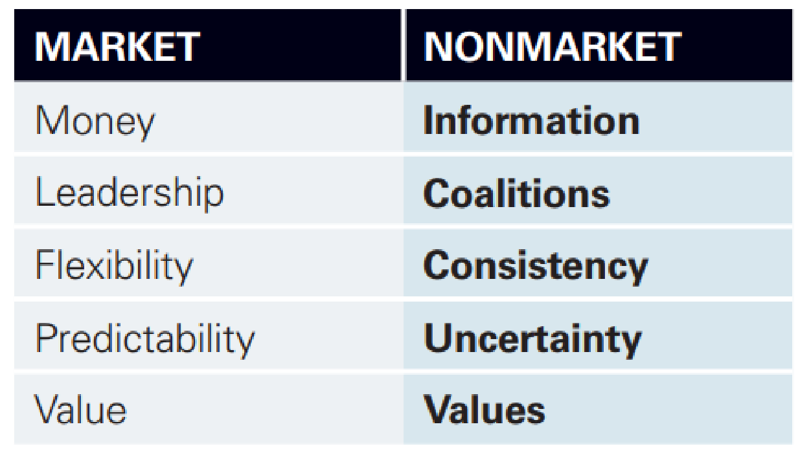

# 6: Governance Of The Global Digital Economy

## Policy Impediments to Digital Globalization

### Digital Globalization

#### Definition
Is the integration of national digital economies, driven by the cross-border expenasion of digital value chains

### Non-Market Environment
- Company's Market Environment: Customers, Competitors, Suppliers
- Company's Non-Market Environment: Media, State, NGO's etc.

<figure markdown>
  { width="500" }
  <figcaption>Difference Market & Non-Market</figcaption>
</figure>

#### (IA)^3 Framework

- **3 I's**: Issues, interests, information
- **3 A's**: Actors, Arenas, Assets

#### Digital Value Chains (DVCs)
- Monetization of data
- Services transferred digitally across borders
- Network effects and scale opportunities
- **Privacy Shields**: Schrems 1 
	- Privacy Shield: Self certified by businesses
	- GDPR: No personal data transfers outside of the EU, unless the country has Privacy protection similar to GDPR
	- Context: US has no national privacy law

### Why is digital globalization so controversial
- Data are different

#### Three new Economy Faultlines
- Surveillance / Privacy
- Inequality / Concentration
- Tax Fairness (Avoidance)

### From splintering to digital market integration
- Digital Privacy Laws (Converging across the world)
- Agreements on Competition Policy
- Tax Reforms (to avoid avoidance like in Ireland)

#### Current State
- Agreements on Data flows: There are none
- Localization Barriers example China: Partnership with government, Data in Chinese datacenters
- Spectrum: No restriction (USA) -> Local storage -> Local storage and processing -> Ban To Transfer (China)
- Data flow regime: GDPR -> Ban to transfer if privacy do not converge

## Digital Trade Politics
- Vast differences in digital trade regulation in comparison to goods trade regulation

### Explaining factors	
- International institutions (Enforcement, Credibility)
- National Governments (Security, Political acceptance)
- Firms (Market access)
- Society (Privacy, Democracy)

#### Three Data Governance models
- Liberal: U.S., Japan
	- Methods: Little oversight (market solves issues)
	- Framing: Encourage growth, consumer choice
- Interventionist: E.U, Canada, Australia, Korea
	- Methods: Regulation of data collection and flows
	- Framing: Citizen rights
- Restrictive: China, Russia
	- Methods: Restrict flow, local storage requirements
	- Framing: Public Order, National Security (i.e. Regime Power)

### Summary of today's lecture
- Digital services trade is growing faster than goods trade. . . but institutions are lagging behind
- No global rules on data, so countries have a lot of leeway to govern digital technology and data flows how they want
- International cooperation is complicated by differing citizen concerns, business influence, and political constraints
